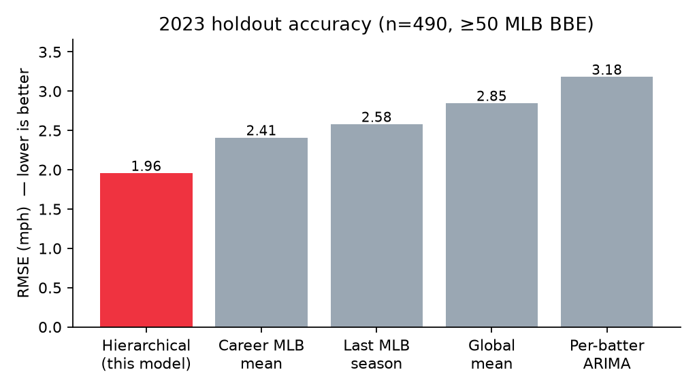
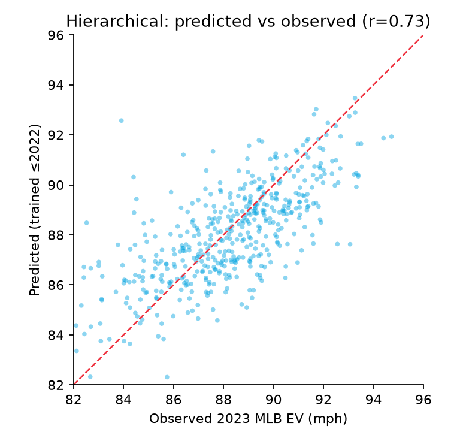
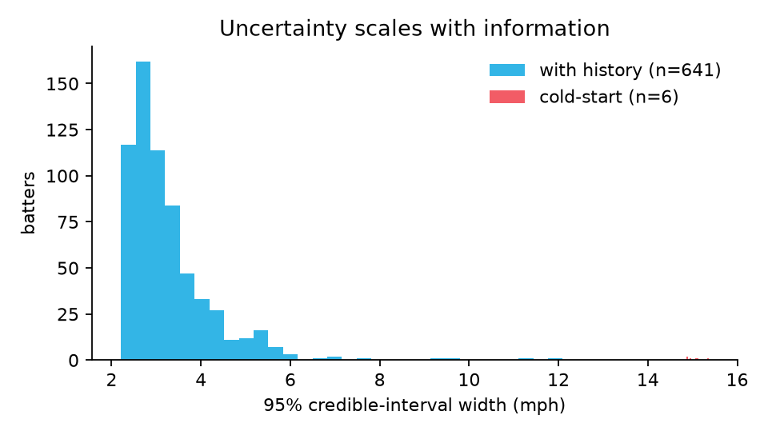

# How Hard Will He Hit It? Projecting Baseball Exit Velocity with a Hierarchical Bayesian Model

### Why "just average last year" loses, and partial pooling wins — by 19%.

If you want to know how hard a hitter will hit the ball next season, the obvious move is to look at how hard he hit it last season. It's also the wrong move — or at least a beatable one. Last year's number is part talent and part luck, and the two are tangled together in proportions that depend on something most projections ignore: **how much you actually saw him swing.**

This is the story of a model that untangles them. The task: estimate each hitter's *underlying* average exit velocity against MLB-level competition, and project it forward a season. The dataset: 1.34 million batted balls across MLB, Triple-A, and Double-A. The result: a hierarchical Bayesian model that beats every naive baseline out-of-sample and, along the way, overturns a piece of conventional wisdom about the minor leagues.

---

## The problem hiding in the data

Two facts about the data dictated everything that followed.

**First, the data is wildly uneven.** Of 3,715 hitters, 1,642 appear in just a single season. Within a season, one hitter might have 700 tracked batted balls and another might have 4. A 4-ball average is almost pure noise; a 700-ball average is close to truth. Any model that treats those two numbers as equally trustworthy is throwing away the single most important piece of information it has.

**Second, you have to compare across levels.** Roughly 100 of the hitters we need to project to MLB have *only* minor-league data. To say anything about their major-league ability, you need to know the exchange rate between a Double-A exit velocity and an MLB one — and that rate has to be *learned from the data*, not assumed.

Both problems point to the same family of solution: **a hierarchical model with partial pooling.**

---

## The core idea: shrink toward the crowd, in proportion to your ignorance

Partial pooling is the statistical version of a very human intuition. If a rookie posts a blistering exit velocity over 20 batted balls, you don't believe all of it — you mentally drag your estimate back toward "league average for a guy like this." If a veteran posts the same number over 600 batted balls, you barely discount it at all.

The model formalizes exactly this. Each hitter gets a latent ability, and the estimate of that ability is **shrunk toward the population mean by an amount that scales with how noisy his data is.** Regression to the mean isn't a correction we bolt on afterward — it falls out of the math automatically.

The trick that makes it efficient is to model **cell means with known measurement error.** Instead of fitting 1.34 million individual batted balls, we collapse them into roughly 6,000 *(batter, season, level)* cells. Each cell carries its mean exit velocity and — crucially — its standard error, `se = s / √n`. A cell built from 700 balls has a tiny standard error and pulls hard on the model; a cell built from 4 balls has a huge one and barely registers.

```python
# Collapse 1.3M batted balls -> ~6k cells, keeping the per-cell precision (se).
g = (df.groupby(["batter_id", "season", "level_abbr"])
       .agg(mean_ev=("exit_velo", "mean"),
            sd_ev=("exit_velo", "std"),
            n=("exit_velo", "size"),
            age=("age", "mean"))
       .reset_index())

g["sd_ev"] = g["sd_ev"].fillna(df["exit_velo"].std())   # 1-ball cells -> pooled SD
g["se"]    = g["sd_ev"] / np.sqrt(g["n"])               # <- this drives the shrinkage
```

That `se` term is the whole game. It is how the model knows that not all averages are created equal.

---

## The math, for the curious

Let cell *c* belong to batter *b(c)*, season *t(c)*, and level *ℓ(c)*, with observed mean exit velocity ȳ_c and **known** standard error se_c. The model is:

```
ȳ_c  ~  Normal( μ_c , se_c )

μ_c  =  μ₀
      + θ_{b(c)}          # latent batter ability (the target)
      + η_{b(c), t(c)}    # batter-season "form" intercept
      + α_{ℓ(c)}          # level effect, MLB is the reference (α_MLB ≡ 0)
      + β₁·a_c + β₂·a_c²   # population age curve (a_c = age centered)
```

Two modeling choices do the heavy lifting:

**1. Known measurement error.** Treating `se_c` as fixed in the likelihood is what produces sample-size-weighted shrinkage. A batter's ability `θ_b` is effectively a precision-weighted average of his cells, pulled toward the population mean `μ₀` — and the pull is strongest exactly where his data is thinnest.

**2. Non-centered parameterization.** Hierarchical models with thousands of groups sample badly if written naively (the funnel pathology). We reparameterize every random effect as a standard normal scaled by its group SD:

```
θ_b = σ_θ · z_b ,   z_b ~ Normal(0, 1)
```

Priors are weakly informative — wide enough to let the data drive the level effects and the age curve, tight enough to regularize:

```
μ₀      ~ Normal(89, 5)
α       ~ Normal(-1.5, 4)        # wide: the data decides sign and size
β₁, β₂  ~ Normal(0, 0.5), Normal(0, 0.1)
σ_θ     ~ HalfNormal(5)          # between-batter talent SD
σ_s     ~ HalfNormal(2)          # season-to-season form SD
```

Here is the model, essentially verbatim, in PyMC:

```python
import pymc as pm

with pm.Model(coords=coords) as model:
    mu0   = pm.Normal("mu_global", 89.0, 5.0)
    alpha = pm.Normal("alpha_nonref", mu=[-1.5, -1.5], sigma=4.0, dims="level_nonref")
    b1    = pm.Normal("b_age1", 0.0, 0.5)
    b2    = pm.Normal("b_age2", 0.0, 0.1)

    # non-centered batter ability
    s_b   = pm.HalfNormal("sigma_batter", 5.0)
    z_b   = pm.Normal("z_batter", 0.0, 1.0, dims="batter")
    theta = pm.Deterministic("theta_batter", z_b * s_b, dims="batter")

    # batter-season "form" intercept -> identifies the level effect WITHIN a season
    s_s   = pm.HalfNormal("sigma_season", 2.0)
    z_s   = pm.Normal("z_bs", 0.0, 1.0, dims="batter_season")

    mu = (mu0
          + theta[batter_codes] + z_s[bs_codes] * s_s
          + alpha[0]*is_aaa + alpha[1]*is_aa
          + b1*age_c + b2*age_c**2)

    # likelihood: known per-cell measurement error
    pm.Normal("obs", mu=mu, sigma=se, observed=cell_mean)

with model:
    idata = pm.sample(draws=1500, tune=2000, chains=4, target_accept=0.95)
```

Sampling finishes in about 90 seconds with **0 divergences** and **R-hat ≤ 1.006** — clean convergence.

---

## A finding that surprised me: the minors aren't where exit velocity goes to shrink

Conventional baseball wisdom — and the hard-coded constants in a baseline time-series model I was comparing against — assume exit velocity is *lower* in the minor leagues. The point is people *assume* a number and a sign.

So I let the data speak, using the cleanest possible comparison: the **same hitter, in the same season, who appeared at two levels.** That holds talent, age, and development fixed and isolates the level effect.

```python
cell = df.groupby(["batter_id","season","level_abbr"]).exit_velo.mean().reset_index()
piv  = cell.pivot_table(index=["batter_id","season"], columns="level_abbr",
                        values="exit_velo")
print((piv["AAA"] - piv["MLB"]).dropna().mean())   # +1.75 mph  (AAA is HIGHER)
```

The answer was unambiguous, and it pointed the *opposite* way from the baseline's assumption. For the same hitter in the same year, exit velocity is **higher** in the minors than in MLB:

- **AAA vs MLB: +1.26 mph** (95% interval [1.17, 1.36])
- **AA vs MLB: +1.44 mph** ([1.31, 1.57])

To project a minor leaguer's MLB exit velocity, you should **subtract** about 1.3 mph — not add it. MLB pitching is harder to square up, and average contact quality drops accordingly. The baseline model I was comparing against had this backwards, with a constant of the wrong sign *and* the wrong magnitude.

There's a subtle lesson here. If you compute the level gap *across* seasons instead of within them, the sign flips — because hitters move between levels for reasons correlated with how they're playing. Only the within-batter, within-season contrast is clean. The model captures this by giving each *batter-season* its own "form" intercept (`η`), so the level coefficient is identified strictly from hitters seen at multiple levels in the same year.

---

## Does it actually work? A strict 2023 holdout

A model that fits the past beautifully and predicts the future poorly is worthless. So I ran a genuine out-of-sample test: **train on 2019–2022 only, then predict the observed 2023 MLB exit velocity** for the 490 hitters who had a stable target (≥50 MLB batted balls in 2023). Every method scored on the identical set of hitters.

| Method | RMSE | MAE | Correlation |
|---|---|---|---|
| **Hierarchical (this model)** | **1.96** | **1.48** | **0.73** |
| Career MLB mean (naive) | 2.41 | 1.69 | 0.64 |
| Last MLB season (naive) | 2.58 | 1.82 | 0.62 |
| Global mean | 2.85 | 2.20 | 0.00 |
| Per-batter ARIMA | 3.18 | 2.06 | 0.53 |

Two things jump out.

**The hierarchical model wins by ~19%** over the best naive baseline (career average), with near-zero bias and the highest correlation.

**The per-batter time-series model is the *worst* of all five — beaten even by predicting a single constant for everyone.** This is the cautionary tale. Fitting an individual ARIMA to each hitter's 3–4 noisy annual data points doesn't find signal; it finds noise and confidently extrapolates it. Sophistication aimed at the wrong structure is worse than no sophistication at all.




The predicted-vs-observed plot tells the visual version of the story. The point cloud hugs the diagonal (r = 0.73) but is deliberately *flatter* than the 45° line — high-observed hitters are nudged down, low-observed hitters nudged up. That tilt isn't error. It's the shrinkage doing its job: betting, correctly, that some of last year's extremes were luck.

---

## Uncertainty you can actually trust

Because the model is Bayesian, every projection comes with a credible interval — and those intervals are *honest about what the model doesn't know.* Projecting a hitter's 2024 MLB ability is just reading the posterior with the level set to MLB and the form term to its mean:

```python
# 2024 MLB ability = global + batter talent + (MLB reference: α=0) + age curve
ability = mu0_draws + theta_b_draws + b1_draws*age_c + b2_draws*age_c**2
pred    = ability.mean()
lo, hi  = np.percentile(ability, [2.5, 97.5])    # 95% credible interval
```



For hitters with real playing history, the average 95% interval is a tight **3.3 mph**. For the handful of "cold-start" hitters with no prior data, it balloons to **15 mph** — the model is loudly telling you it's guessing. A point estimate alone would hide that distinction; a front office making decisions absolutely needs to see it.

---

## What I'd build next

The model is good, not finished. The clearest next step is **quality-of-competition adjustment**: a hitter who faced a brutal slate of pitchers should get credit for it. The plan is a two-stage approach — estimate each pitcher's exit-velocity-suppression effect (shrunk by sample size, naturally), then adjust each hitter's ability for the average quality of arms he actually faced. Other extensions: individual aging curves rather than a single population curve, and modeling batted-ball outcomes jointly with exit velocity.

---

## The takeaway

The headline isn't the Bayesian machinery. It's the principle the machinery enforces: **trust each data point exactly as much as it deserves, and no more.** A 700-ball season is near-truth; a 4-ball season is a rumor; a minor-league number needs translating before you believe it about the majors. Bake those judgments into the model instead of into your gut, validate them out-of-sample, and you get projections that are both more accurate *and* more honest about their own limits.

Last year's number is a starting point. The art is knowing how much of it to believe.

---

*Code and full methodology: [link your GitHub repo]. Built with PyMC.*
